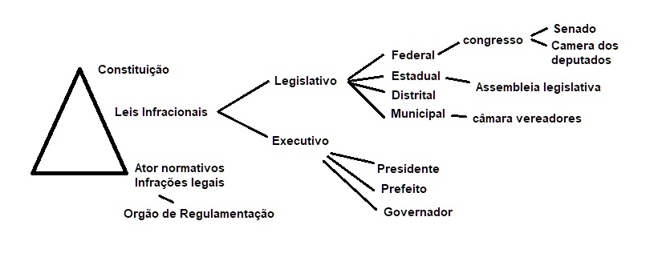
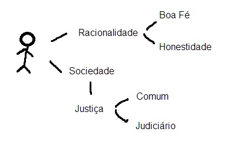

# PG515_Direto_e_Etica_em_Informatica

Data:
07/02 - AV1
04/04 - AV2
10/04 - SEGUNDA CHAMADA
11/04 - FINAL

Expressão:
- Amicus curiae (amigo da corte) é uma expressão latina utilizada para designar o terceiro que ingressa no processo com a função de fornecer subsídios ao órgão julgador

Diferença Promotor x Procurador

O procurador de justiça tem uma função parecida com o promotor. Ele é responsável pela defesa dos direitos coletivos e atua em ações penais e públicas, com instauração de inquéritos e fiscalização da lei. Enquanto o promotor representa o povo, o procurador representa a união estados e municípios.

Processos que seguem em segredo (ou por questão de segurança ou questão de constrangimento)

# Aspectos Juridicos SI

Juridico
  - Lei
  - Normas
  - Codificações
  - Poder Judiciário
  - Poder Legislativo -> Representa a Sociedade
  - Poder Executivo -> Necessidade da Sociedade

Todo mundo é subordinado ao estado

Os contratos são feitos para não ler.

<!--- gina.gouveia@UFPE.br -->
--------------------------------------------------------------

Estado -> Bem comum
  *Supremacia do Interece publico sobre o particular

Justiça -> É um sentimento

LEI

Sociedade
  - Direito
    - Liberdade
    - Garantia
    - Dignidade
    - Meio Ambiente
   
Organização do estado Brasileiro

------------------------------------------------
Texto: ALÉM DA TECNOLOGIA: ÉTICA E RESPONSABILIDADE NA
ERA DA INTELIGÊNCIA ARTIFICIAL

Relação entre inteligência artificial (IA) e
ética humana - "sociedade de risco" de Ulrich Beck,

Harari (2015, p.361), - três revoluções que
moldaram a história humana: a cognitiva, a agrícola e a científica. - 

Cognitiva: Homo sapiens conseguiu prevalecer em relação aos outros animais por vários motivos, entre eles a diferença do cérebro humano

agrícola: utilizando ferramentas que permitiram aumentar progressivamente os períodos que passavam num mesmo lugar, aprimorando o modo de vida

científica: As revoluções científicas são etapas do desenvolvimento da ciência em
que incide uma modificação nas estratégias de pesquisa estabelecidas por
seus fundamentos.

T. Kuhn (2012, p.15-17), dividiu em três etapas distintas a evolução do conhecimento científico. pré-paradigmática, ciência normal,  

pré-paradigmática:a descoberta de uma teoria para solucionar o problema ainda não havia sido identificada.

ciência normal: sobrevém uma teoria capaz de solucionar a maioria dos problemas, os pesquisadores não fazem objetção a ela por acredirem em sua veracidade. Entretanto, com o decorrer do tempo manifestam-se anomalias difíceis de serem sanadas.

ciência revolucionária: se constitui quando inúmeras anomalias se fazem presentes, levando os cientistas a renegarem uma teoria, estabelecendo o embate entre grupos distintos de cientistas que passam a advogar em favor de diferentes teorias.

Kuhn (2012) observou que, na prática científica, investia-se para que a natureza se adequasse aos paradigmas preestabelecidos. Para ele, a ciência normal segue a metáfora dos "puzzles", onde o resultado é conhecido, e o desafio é desvendar os meios para alcançá-lo. Kuhn afirmou que os cientistas não buscam a verdade, mas resolver enigmas e problemas. Durante esse processo, os dogmas são essenciais, pois determinam os "puzzles" e os critérios para sua solução. Paradigmas conflitantes são desencorajados, e a comunidade científica converge para a solução dos enigmas. Resolver esses "puzzles" resulta em fama e reconhecimento, mas é necessário que o cientista faça parte de uma comunidade científica para que seu trabalho seja legitimado. A adoção de um paradigma é crucial para controlar e estimular o avanço da pesquisa. A produção do conhecimento científico é realizada por meio de ensaios, inferências e observações, e os resultados precisam atender a critérios e normas para serem aceitos pela comunidade científica.

paradigma - usado em dois sentidos diferentes
De um lado, indica toda a constelação de crenças, valores, técnicas etc.,
partilhadas pelos membros de uma comunidade determinada.

De outro, denota um tipo de elemento dessa constelação: as soluções
concretas de quebra-cabeças que, empregadas como modelos ou
exemplos,

Durante as revoluções científicas, novas descobertas e avanços resultam em contribuições significativas, como novas técnicas e tecnologias.
Os termos "técnica" e "tecnologia" vêm da palavra grega "techne", que significa o conjunto de conhecimentos sobre uma prática produtiva.
Heidegger (2007) define a técnica como uma atividade humana, sendo um meio para alcançar um fim, uma manifestação da vontade humana livre.
Ele distingue entre técnica instrumental (fazer as coisas) e técnica antropológica (atividade humana), convidando a uma compreensão mais profunda da instrumentalidade da técnica à luz da causalidade.
Heidegger usa o exemplo do cálice de prata para explicar as quatro causas (material, forma, fim e efeito) envolvidas na criação de um objeto.
A relação entre essas causas não é completamente explicada pela causalidade tradicional, e o ourives é visto como responsável pela criação do cálice, sendo o ponto de partida para sua existência.
Heidegger faz uma distinção entre "poeisis" (geração) e "physis" (produção na natureza), considerando ambas formas de gerar algo que não existia.
"Poeisis" é associada à revelação e à verdade (aletheia), sugerindo que a técnica é uma forma de revelar o mundo, semelhante à poesia.
A palavra "techne" é ligada à episteme (conhecimento), com "techne" referindo-se à intervenção do homem na natureza, enquanto "episteme" se relaciona ao conhecimento da própria natureza.
Heidegger argumenta que o essencial na "techne" não está no fazer, manipular ou uso de meios, mas na revelação do que não se apresenta.

----------------------------------------

- Conceito de estado
- elementos do estado
- Finalidade do estado
- justiça/bem comum
- separação das funções do estado com a lei a a ética
- aspectos juridos esposição de dados pessoais na internet e sua relação com o direito fundamental

--------------

- A construção da idéia de justiça apartir do estado
- Ética: Conceito, sentido, relação com a sociedade
- Estado: Papel do estado na responsabilidade ética/moral
              
----------------------------------

Estrutura da Lei

Parte Preliminares

- Identificação:
 O título ou epígrafe da lei, geralmente indicando o número e o ano de publicação.
- Ementa
Resumo do conteúdo da lei.
- Preâmbulo (Opcional)
(Opcional) Contextualiza a lei, explicando os motivos e os objetivos da sua criação.

Parte normativa:

- Artigo (cebeçalho)
A unidade básica de articulação da lei, que contém a norma jurídica.
- Inciso
Subdivisões dos artigos ou parágrafos, frequentemente utilizadas para listar diferentes casos ou situações em que a norma se aplica
- Paragrafo
Podem ser usados para detalhar ou modificar um artigo, ou mesmo quando o artigo é único, sendo então chamado de "Parágrafo único"
- Alínha
Subdivisões dos incisos, que podem detalhar ainda mais os casos ou situações
- Item
Subdivisões das alíneas, usadas para listar pontos específicos dentro de um quadro mais amplo. 
